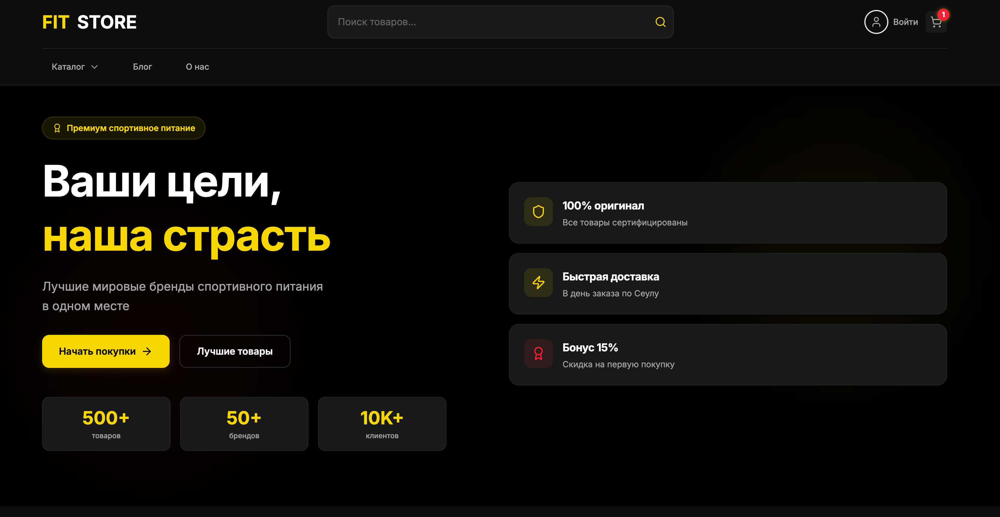
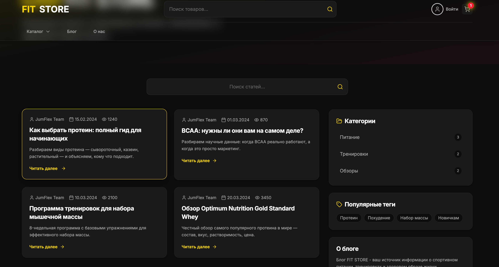
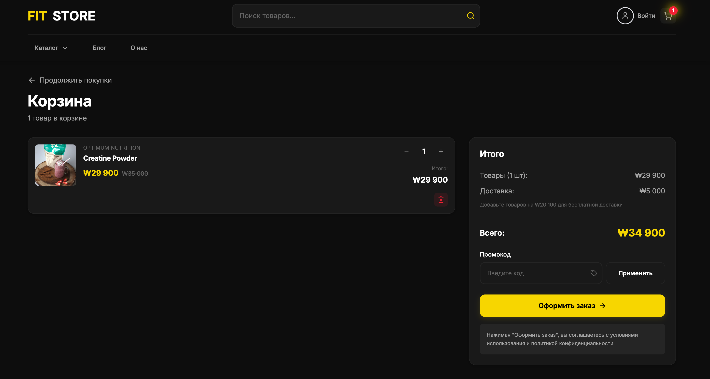
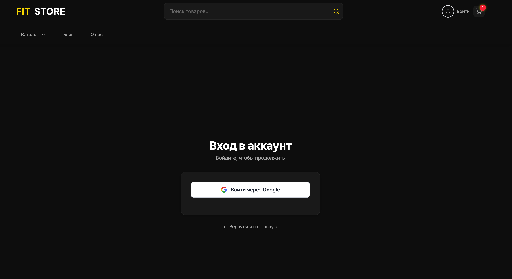

# JumFlex — Sports Nutrition E-Commerce

> Full-stack e-commerce platform for a sports nutrition store. Built with Next.js 16, Supabase, and NextAuth. Includes a full admin panel, blog CMS, product ratings, reviews, and Google OAuth.

## Screenshots






---

## Features

- **Product catalog** — filtering by category and brand, sorting, pagination, search
- **Product detail** — photo gallery, ingredients, usage instructions, ratings, reviews, comments
- **Cart & wishlist** — Zustand-powered state management
- **Checkout flow** — shipping form, address management, order confirmation
- **Auth** — NextAuth with credentials + Google OAuth, role-based access (user / admin)
- **User account** — order history, saved addresses, wishlist
- **Blog** — full CMS with categories, tags, markdown editor (SimpleMDE), slug-based routing
- **Admin panel** — manage products, categories, orders, users, blog posts
- **SEO** — structured data (JSON-LD), breadcrumbs, FAQ schema, dynamic meta tags
- **Google Analytics** — integrated GA4
- **Image upload** — Supabase Storage via admin API

---

## Tech Stack

| Layer | Technology |
|---|---|
| Framework | Next.js 16 (App Router) |
| Language | TypeScript |
| Styling | Tailwind CSS |
| State | Zustand |
| Database | Supabase (PostgreSQL) |
| Auth | NextAuth v4 + Google OAuth |
| Forms | React Hook Form + Zod |
| Blog editor | SimpleMDE / EasyMDE |
| Deployment | Vercel |

---

## Getting Started

### Prerequisites

- Node.js 18+
- Supabase project
- Google OAuth credentials (optional)

### Installation

```bash
git clone https://github.com/Nikolanikol/jumflex.git
cd jumflex
npm install
```

### Environment Variables

Create `.env.local` in the root:

```env
# Supabase
NEXT_PUBLIC_SUPABASE_URL=your_supabase_url
NEXT_PUBLIC_SUPABASE_ANON_KEY=your_supabase_anon_key
SUPABASE_SERVICE_ROLE_KEY=your_service_role_key

# NextAuth
NEXTAUTH_URL=http://localhost:3000
NEXTAUTH_SECRET=your_nextauth_secret

# Google OAuth (optional)
GOOGLE_CLIENT_ID=your_google_client_id
GOOGLE_CLIENT_SECRET=your_google_client_secret
```

### Database

Run the migration to support Google OAuth:

```sql
-- makes password_hash nullable for OAuth users
ALTER TABLE users ALTER COLUMN password_hash DROP NOT NULL;
CREATE INDEX IF NOT EXISTS idx_users_email ON users(email);
```

### Run

```bash
npm run dev
```

Open [http://localhost:3000](http://localhost:3000)

---

## Project Structure

```
src/
├── app/                  # Next.js App Router pages & API routes
│   ├── api/              # REST endpoints (products, orders, blog, auth, ratings)
│   ├── admin/            # Admin panel (products, orders, users, blog)
│   ├── account/          # User profile, orders, addresses, wishlist
│   ├── blog/             # Blog with categories, tags, slugs
│   ├── products/         # Product listing & detail pages
│   └── checkout/         # Checkout flow
├── components/           # UI components by feature
├── lib/                  # Supabase client, auth config, SEO utils
├── store/                # Zustand stores (cart, wishlist)
└── types/                # TypeScript types
```

---

## Admin Panel

Available at `/admin`. Requires admin role.

Sections: Dashboard · Products · Categories · Orders · Users · Blog (posts, categories, tags)

---

## License

Private commercial project. All rights reserved.
